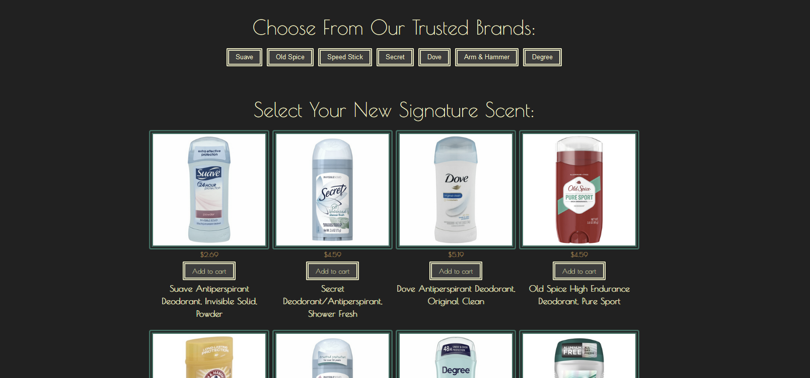
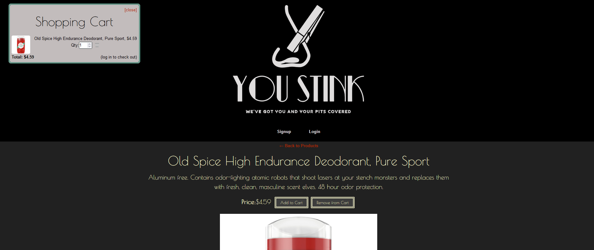

# you-stink

## Description

You Stink! But help is on the way! With our huge selection of beautiful smelling deodorants and antiperspirants, you can go from smelling like B.O. to smelling like a V.I.P.

You Stink is an online marketplace specializing in deodorant and antiperspirant products. We carry products from all of the trusted names in fragrance such as Dove, Old Spice, and Degree. So whether it's stress, summer, or exercise that's got you sweating, we've got you (and your pits) covered.

## Installation

No installation necessary. The site can be found [here](https://agile-forest-79656.herokuapp.com/
) and is usable from your computer, phone, or tablet device.

## Usage

Before you can set out on your scent safari, you'll need to make an account with us. Proceed to the Login page at the top and create an account. We'll need your first and last name, email address, and a password to create an account for you. If you already have an account with us, you can log in via the login link in the header.

Once you're registered, you can head back to the home page to begin shopping! Click on any of the product thumbnails to view a description of the product. 

Once you find the fragrance of your dreams, click Add To Cart. You can add multiple sticks of as many fragrances as you want!

When you're satisfied with the contents of your sweet-smelling shopping cart, click on the cart icon at the top left, and proceed by clicking the Checkout button.

You will be redirected to our secure payment partner, Stripe. Follow the instructions on Stripe to checkout, and voila, you're done!

## Technologies Used

This application utilizes React to create an interactive front end experience. The site can toggle between home page, login, sign-up, and product pages without leaving the base HTML site. Products, brands, and shopping carts are saved in IndexedDB to allow for persistant data. MongoDB/Mongoose is used for the models and schema. The site also uses a manifest in order to give the site its own unique icon in the browser.

## Credits

You Stink is a collaboration by [Andrew Dean](https://github.com/0Adean0), [Dan Rescigno](dannydelts94), and [Colin Leidy](CollyLee).